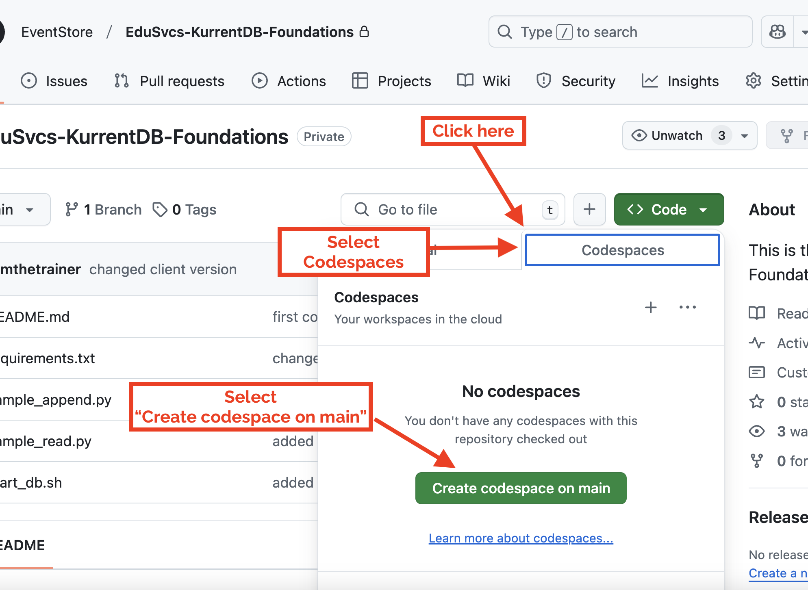
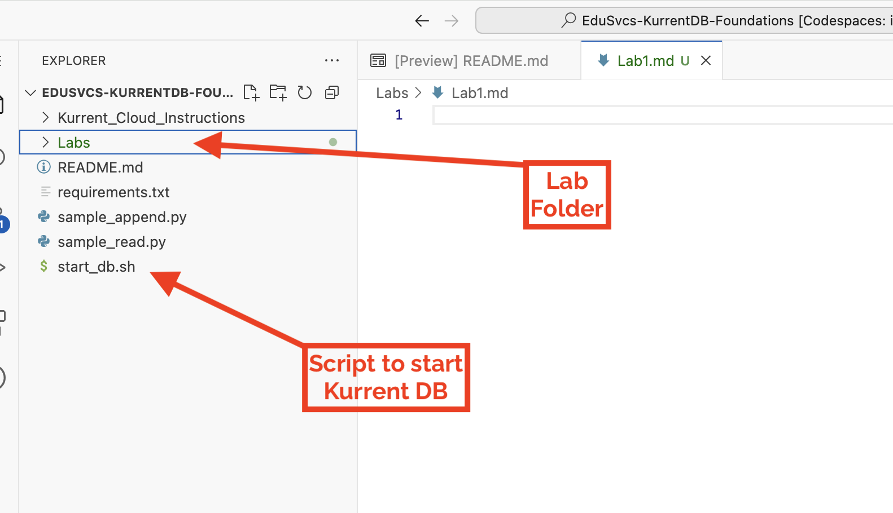
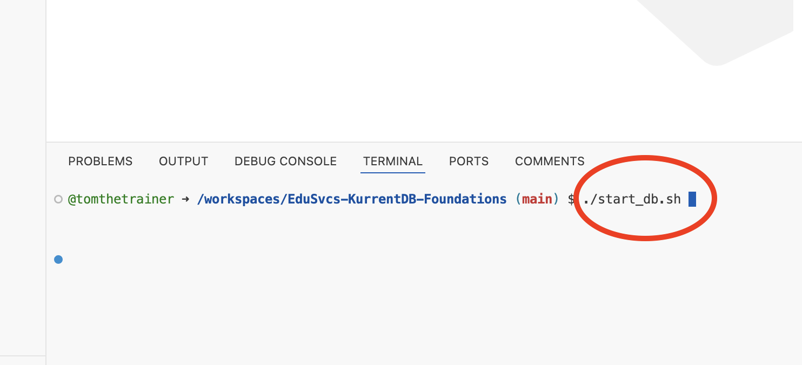
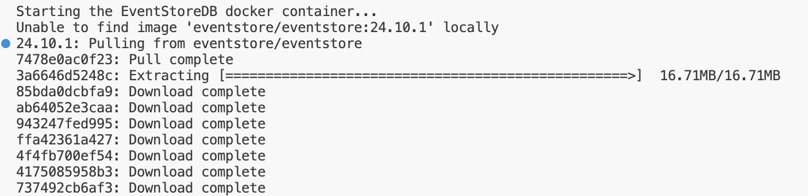
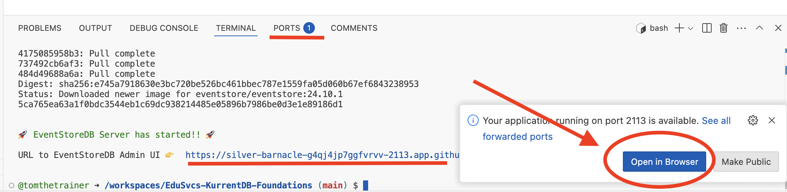
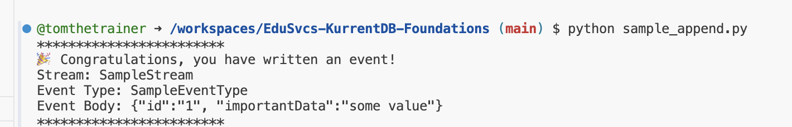
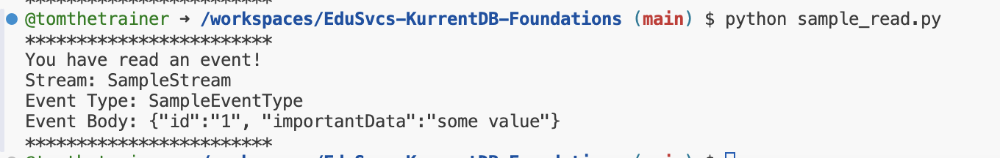
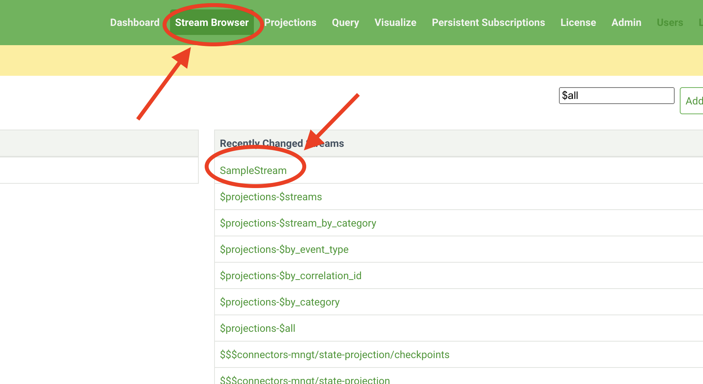
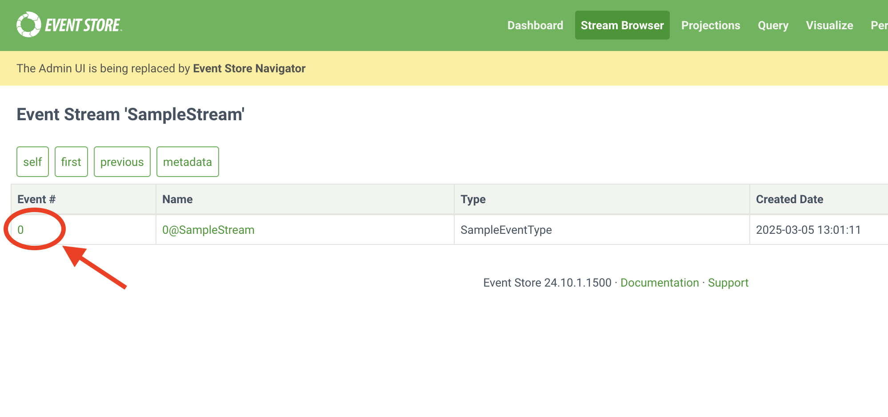

# Lab:  Explore the Classroom Environment

version:1.0

## Overview 

In this lab, you will:

1. Create a github CodeSpace on the class repository
2. Start EventStoreDB
3. Create and append an event using the EventStoreDB webui


## Step 1: Navigate to the Github repository

Point a browser at [github.com/EventStore/EduSvcs-KurrentDB-Foundations](https://github.com/EventStore/EduSvcs-KurrentDB-Foundations) 


## Step 2: Create Codespace on Main





GitHub codespaces provide the following. 
1. A docker container
2. A browser based implementation of vscode
3. docker-in-docker
4. http forwarding of web services


## Step 3: Review the Contents

* LABS folder
    * Contains the class Lab instructions
* Kurrent_Cloud_Instructions
    * Contain Instructions on running codespace code against a KurrentDB cloud instance 
* requirements.txt
    * Contain the python modules needed to execute the code
    * These are automatically installed when using vscode.       
* sample_****.py
    * code samples
* start_db.sh
    * shell script that starts KurrentDB    



## Step 4: Start KurrentDB

In the terminal window at the bottom of the screen, enter the following command.

```
./start_db.sh
```



`start_db.sh` launches a KurrentDB docker instance inside codespaces. 

As it runs you should see progress reports to the terminal. 



The `start_db.sh` command does the following.

Checks to see if the docker engine is running, if not it sleeps until docker is running. 

Starts or restarts the KurrentDB docker container. The command it executes is included in the shell script as comments, feel free to read that if you would like. 

Generates a url to use in codespaces for the KurrentDB webui.


## Step 5: View the KurrentDB webui

Use the `Open in Browser` button to open the KurrentDB webui in another browser tab.

The underlined links would also work to access the webui. 



Note that when a docker instance that has public http ports is launched in codespaces  these ports are automatically forwarded, as we see here with the webui. https ports require an additional configuration step. 


## Step 6: Append an Event

In the terminal run 

```
python sample_append.py
```

If KurrentDB is running you should see the following in the terminal. 



If this fails, re-execute `./start_db.sh` and try again. 

## Step 7: Read an Event

In the terminal run

```
python sample_read.py
```

You should see...



If the command fails, verify that KurrentDB is running, and that you have ran `sample_append.py`

## Step 7: View the Event in the Webui

In the webui select `stream browser` from the top panel.



Then select the stream `SampleStream`



## Congratulations !!!

You have explored the classroom codespace environment
